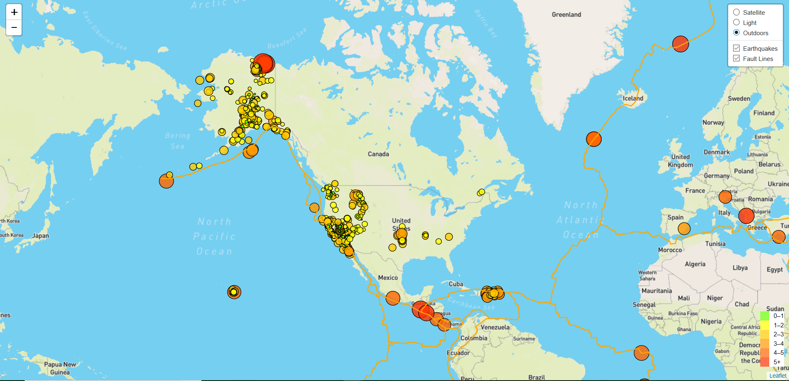
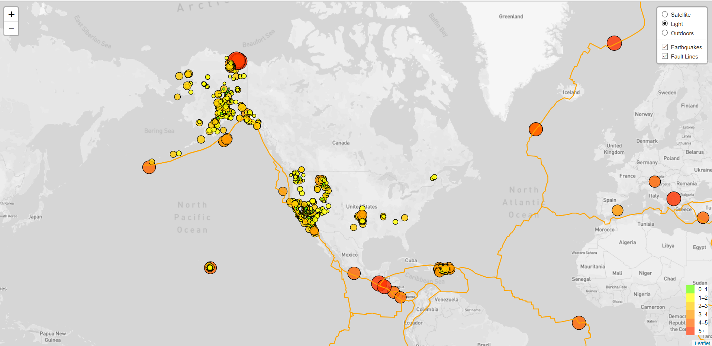
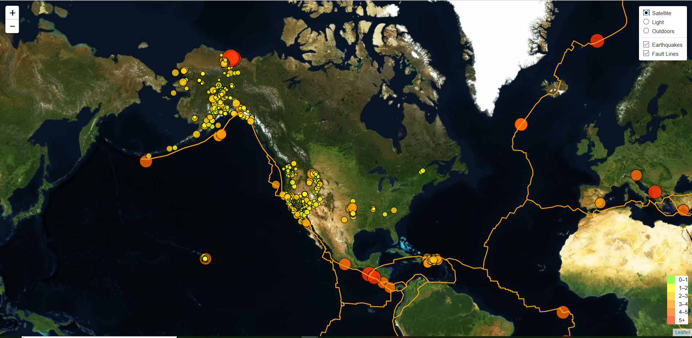

# Visualizing Earthquake Data with Leaftlet

The USGS is responsible for providing scientific data about natural hazards, the health of our ecosystems and environment; and the impacts of climate and land-use change. Their scientists develop new methods and tools to supply timely, relevant, and useful information about the Earth and its processes.The USGS provides earthquake data in a number of different formats, updated every 5 minutes.

## Dataset

[Earthquake Data](https://earthquake.usgs.gov/earthquakes/feed/v1.0/summary/all_week.geojson)

[Tectonic Plates Data](https://raw.githubusercontent.com/fraxen/tectonicplates/master/GeoJSON/PB2002_boundaries.json)

## Visualizing the Data

* The map plots all of the earthquakes and tectonic plates from the respective datasets based on their latitude and longtitude.

* The data markers reflect the magnitude of the earthquake in their size and color. Earthquakes with higher magnitudes appear larger abd darker in color. 

* Popups provide additional information about the earthquake when a marker is clicked.

* Layer Control allows switching between Satellite, Light, and Outdoor maps.

* Legend provides context for the map data.

 

